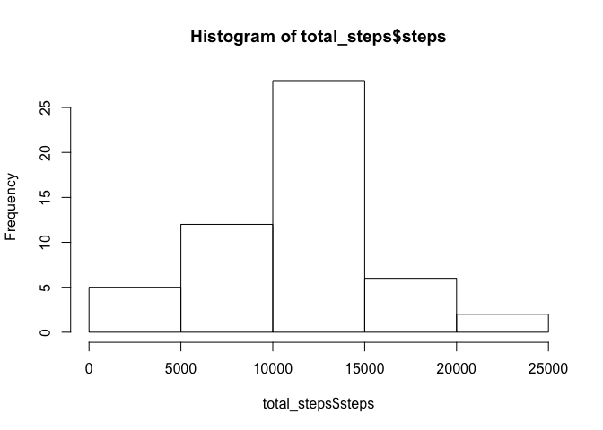
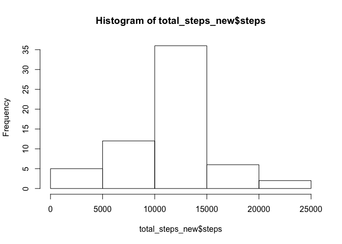
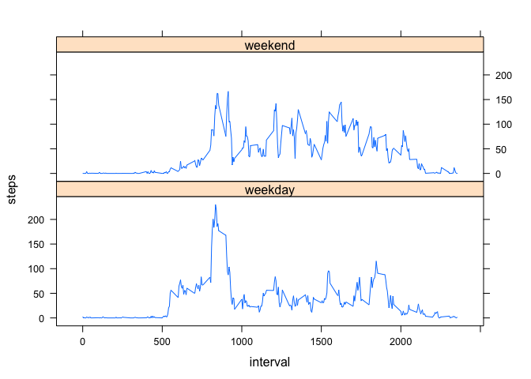

# Reproducible Research: Peer Assessment 1


## Loading and preprocessing the data
* First load the data

```r
act_data=read.csv("activity.csv")
```


## What is mean total number of steps taken per day?
* Calculate mean total number of steps

```r
total_steps=aggregate(steps~date, data = act_data,FUN = sum, na.rm=TRUE)
```
* Make a histogram for total number of steps per day

```r
hist(total_steps$steps)
```

<!-- -->
*Calculate the mean and median of total number of steps per day

```r
mean(total_steps$steps)
```

```
## [1] 10766.19
```

```r
median(total_steps$steps)
```

```
## [1] 10765
```

## What is the average daily activity pattern?
* Plot the 5-minute interval and the average number of steps 

```r
average_daily = aggregate(steps~interval, data = act_data,FUN = mean, na.rm=TRUE)
plot(steps~interval, data = average_daily,type="l")
```

<!-- -->

* Which 5-minute interval contains the maximum number of steps

```r
average_daily[which.max(average_daily$steps),]$interval
```

```
## [1] 835
```

## Imputing missing values
* Find the total number of rows contains NA

```r
sum(is.na(act_data$steps))
```

```
## [1] 2304
```
* Fill in all of the missing values using the mean of that 5-minute interval

```r
index_na = which(is.na(act_data$steps))
act_data_new = act_data
for (i in index_na){
  interval_i = act_data[i,]$interval
  interval_index = which(average_daily$interval==interval_i)
  act_data_new[i,]$steps = average_daily[interval_index,]$steps
}
```
* Histogram of total number of steps each day and Calculate the mean and median total number of steps taken per day. 

```r
total_steps_new=aggregate(steps~date, data = act_data_new,FUN = sum)
hist(total_steps_new$steps)
```

<!-- -->

```r
mean(total_steps_new$steps)
```

```
## [1] 10766.19
```

```r
median(total_steps_new$steps)
```

```
## [1] 10766.19
```
* The mean value is the same as the previous estimate, and the median values is different from the previous estimate. Now the median value is the same as the mean value

## Are there differences in activity patterns between weekdays and weekends?
* Create a new variable indicating whether the date is weekday or not

```r
library(chron)
```

```
## Warning: package 'chron' was built under R version 3.2.5
```

```r
act_data_new$day = is.weekend(as.Date(act_data_new$date))
act_data_new[which(act_data_new$day==FALSE),]$day="weekday"
act_data_new[which(act_data_new$day==TRUE),]$day="weekend"

act_data_new$day = factor(act_data_new$day, levels = c("weekday", "weekend"))
```

* Make a plot of the 5-minute interval and the average number of steps taken averaged across all weekday days or weekend days

```r
averge_5_interval <- aggregate(steps ~ interval + day, data = act_data_new, FUN = mean)

library(lattice)
```

```
## Warning: package 'lattice' was built under R version 3.2.5
```

```r
xyplot(steps ~ interval | day, data = averge_5_interval, type = "l", layout=c(1,2))
```

<!-- -->


